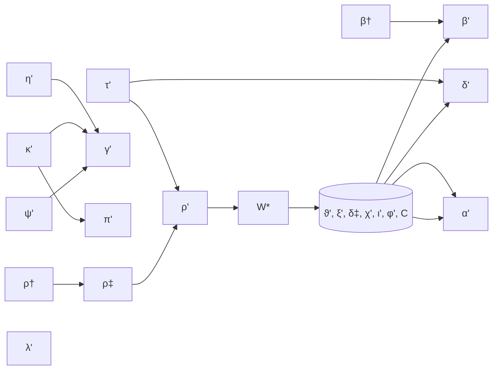

## Spacejam Sync

This module contains the state transition logic for the Spacejam protocol.

## Dependency Graph

```mermaid
graph LR
   %% The new timeslot index
   A[τ'] --> K
   A --> N

   %% An intermediate value for block history
   B[β†] --> C

   %% The updated block history
   C[β']

   %% The updated validator state
   D[γ']

   %% The updated entropy pool
   E[η'] --> D

   %% The updated archived validators
   F[κ'] --> D
   F --> P

   %% An intermediate value for work reports
   I[ρ†] --> J

   %%  Another intermediate value for work reports
   J[ρ‡] --> K

   %% The updated judgements
   H[ψ'] --> D

   %% The updated report state
   K[ρ'] --> L

   %% The set of work-reports ready for accumulation
   L[W*] --> M

   %% accumulation
   M[(ϑ', ξ', δ‡, χ', ι', φ', C)] --> C
   M --> N
   M --> O
   M --> O

   %% The updated service state
   N[δ']

   %% The updated authorization pool
   O[α']

   %% The updated statistics state
   P[π']

   %% The updated archived validators
   G[λ']
```
