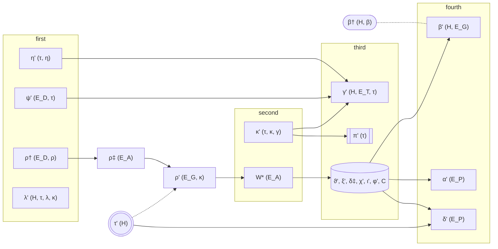

## Spacejam Sync

This module contains the state transition logic for the Spacejam protocol.

## Dependency Graph

> [!NOTE]
> Only shared dependencies will be shown in the graph.

```mermaid
flowchart LR
   %% An intermediate value for block history
   BETA_DAGGER(["β† (H, β)"])
   BETA_DAGGER -.- BETA_PRIME

   %% The updated block history
   BETA_PRIME["β' (H, E_G)"]

   %% The updated authorization pool
   OMEGA_PRIME["α' (E_P)"]

   %% The updated entropy pool
   ETA_PRIME["η' (τ, η)"]
   ETA_PRIME --> GAMMA_PRIME

   %% The updated validator state
   GAMMA_PRIME["γ' (H, E_T, τ)"]

   %% The updated judgements
   PSI_PRIME["ψ' (E_D, τ)"]
   PSI_PRIME --> GAMMA_PRIME

   %% The updated TIMESLOTchived validators
   KAPPA_PRIME["κ' (τ, κ, γ)"]
   KAPPA_PRIME --> GAMMA_PRIME
   KAPPA_PRIME --> PI_PRIME

   %% An intermediate value for work reports
   RHO_DAGGER["ρ† (E_D, ρ)"]
   RHO_DAGGER --> RHO_DDAGER

   %% Another intermediate value for work reports
   RHO_DDAGER["ρ‡ (E_A)"]
   RHO_DDAGER --> RHO_PRIME

   %% The updated report state
   RHO_PRIME["ρ' (E_G, κ)"]
   RHO_PRIME --> WORK_REPORTS

   %% The set of work-reports ready for accumulation
   WORK_REPORTS["W* (E_A)"]
   WORK_REPORTS --> ACCUMULATION

   %% accumulation
   ACCUMULATION[(ϑ', ξ', δ‡, χ', ι', φ', C)]
   ACCUMULATION --> BETA_PRIME
   ACCUMULATION --> DELTA_PRIME
   ACCUMULATION --> OMEGA_PRIME

   %% The updated service state
   DELTA_PRIME["δ' (E_P)"]

   %% The updated statistics state
   PI_PRIME[["π' (τ)"]]

   %% The updated TIMESLOTchived validators
   LAMBDA_PRIME["λ' (H, τ, λ, κ)"]

   %% The new timeslot index
   TAU_PRIME((("τ' (H)")))
   TAU_PRIME ---> DELTA_PRIME
   TAU_PRIME -.-> RHO_PRIME

   %% computation orders
   subgraph "first"
   LAMBDA_PRIME
   PSI_PRIME
   RHO_DAGGER
   ETA_PRIME
   end

   subgraph "second"
   KAPPA_PRIME
   WORK_REPORTS
   end

   subgraph "third"
   GAMMA_PRIME
   PI_PRIME
   ACCUMULATION
   end

   subgraph "fourth"
   BETA_PRIME
   OMEGA_PRIME
   DELTA_PRIME
   end
```
