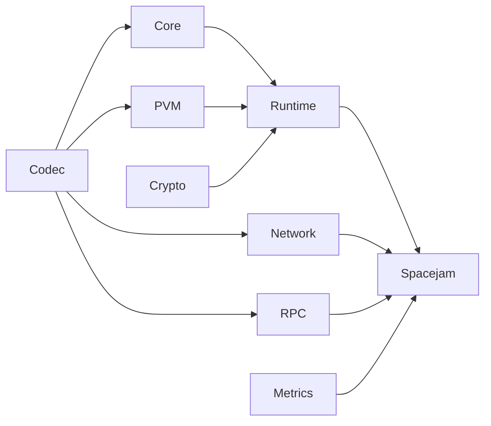

# Architecture

```mermaid
graph LR
    C[Core] --> R
    R[Runtime] --> S
    N[Network] --> S
    RPC[RPC] --> S
    S[Spacejam]
    Crypto[Crypto]
    Codec[Codec] --> C
    Codec --> N
    Codec --> P
    Codec --> RPC
    M[Metrics] --> S
    P[PVM] --> R
    Crypto --> R
```
